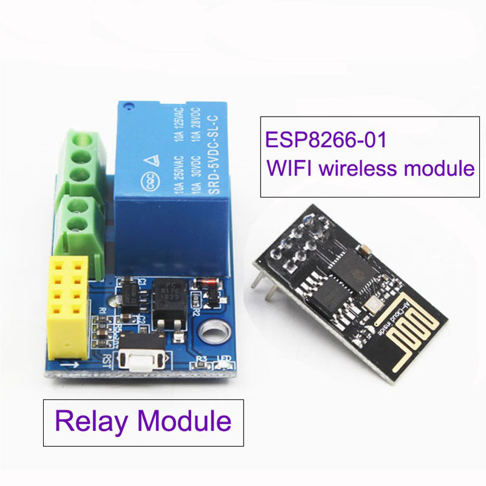

# Router_Booter

This program allows an ESP8266 to ping an address, 
if the address can't be reached, 
the relay turns off and turns back on. The cycle continues,
a number of attempts can be set before a timeout of 1 hour takes place.

## Example

To be used with ```ESP-01/01s``` and ```Relay V4.0```



1. Flash ```router_booter.ino``` into your ```ESP-01`/01s```.
2. Plug the ```ESP-01/01s``` to the relay module.
3. Plug the router and AC to the relay module.
4. Profit.

## Code Usage

clone the repository:
        
    https://github.com/marcoagbarreto/Router_Booter.git

dependencies:

    #include <ESP8266WiFi.h>   //ESP8266WiFi found here: https://github.com/esp8266/Arduino/tree/master/libraries/ESP8266WiFi
    #include <ESP8266Ping.h>   //ESP8266Ping found here: https://github.com/dancol90/ESP8266Ping

(or [download and extract the zip](https://github.com/marcoagbarreto/Router_Booter/archive/refs/heads/main.zip) into your project folder.)

## Known limitations:
* This is intended to be used with low budget routers that constantly freeze.